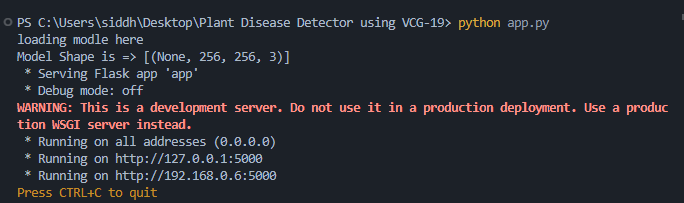

# Plants Disease Detector using VCG 19


## Introduction

Accurate diagnosis of plant diseases is crucial for global health and well-being in today's rapidly changing environment. Early identification and prevention of diseases are essential to avoid potential devastating impacts on humanity, such as global food shortages. Moreover, addressing climate change from an ecological perspective is vital to prevent unnecessary waste of financial resources and achieve a healthier lifestyle.

Unfortunately, relying solely on the naked eye of a human observer to detect all types of plant diseases is challenging and laborious. This repetitive work can be unproductive and prone to errors. To achieve precise and efficient plant disease detection, plant pathologists need to possess strong observation skills to identify characteristic symptoms. However, developing an automated system that utilizes the plant's appearance and visual symptoms to identify diseases would greatly assist in this process.

By deploying an automated system based on deep learning and computer vision techniques, we can address the aforementioned challenges. This system would enable automation of the entire pipeline in agricultural fields, leading to improved efficiency. Machines are capable of outperforming humans in redundant tasks, resulting in enhanced productivity for farms. Our work aims to solve the problem of automating plant disease classification, providing a reliable and efficient solution for accurate diagnosis in the agricultural sector.

## Building

**_Prequired Python3 (https://www.python.org/downloads/)_**
</br>
```bash
# clone the repo
git clone https://github.com/meziyum/Plant-Disease-Detector-using-VCG-19 .

# install dependecies
pip install -r requirements.txt

# run the python file
python app.py
```

**The application can now be accessed at http://127.0.0.1:5000/ on your preferedd browser**



## Plant Disease Detector

Disease detection in plants plays an important role in agriculture as farmers have often to decide
whether the crop they are harvesting is good enough. It is of utmost importance to take these seriously
as it can lead to serious problems in plants due to which respective product quality, quantity or
productivity is affected. Plant diseases cause a periodic outbreak of diseases leading to large-scale
death which severely affects the economy. These problems need to be solved at the initial stage,
to save the lives and money of people. Automatic classification of plant diseases is an important research topic as it is important in monitoring large fields of crops and at a very early stage, if we can
detect the symptoms of diseases when they appear on plant leaves. This enables computer vision
algorithms to provide image-based automatic inspection. Comparatively, manual identification is
labor intensive, less accurate and can be done only in small areas at a time. By this method, the plant
diseases can be identified at the initial stage itself and the pest and infection control tools can be used
to solve pest problems while minimizing risks to people and the environment.


## About Dataset 

[**Link**](https://www.kaggle.com/vipoooool/new-plant-diseases-dataset)

This dataset is recreated using offline augmentation from the original dataset. This dataset consists of about 87K rgb images of healthy and diseased crop leaves which is categorized into 38 different classes. The total dataset is divided into 80/20 ratio of training and validation set preserving the directory structure. A new directory containing 33 test images is created later for prediction purpose.


## Model architecture 

We used VGG19 for enhancing the accuracy of our model.


## Loss and accuracy plot


Accuracy 85%


## Web Application


## Challenges we ran into
1. Difficulty in finding an appropriate dataset with a large number of images.
2. Challenges faced as a newcomer to the Machine Learning domain, including working with numerous functions and libraries.
3. Encountered errors and difficulties due to the usage of VGG-19 architecture, requiring the search for alternative functions and their corresponding libraries.
4. Issues related to pixel manipulation resulting in inaccurate results for certain feed images.
5. Troubles experienced during the deployment of the model on a website and establishing a connection between the backend and frontend components.

## Contributors

[Abhishek]
[Shushant]
[Siddhant]


## Conclusion

Based on the provided image of a plant, the model has successfully determined whether the plant has a disease or not. If a disease is detected, the model can also identify the specific disease that the plant is suffering from.

Knowing whether the plant is affected by a disease allows us to make informed decisions regarding the selection of an appropriate pesticide for prevention and treatment.

By leveraging the model's accurate diagnosis of the plant's health condition, we can effectively address the specific disease and take necessary measures to protect and maintain the plant's well-being.
